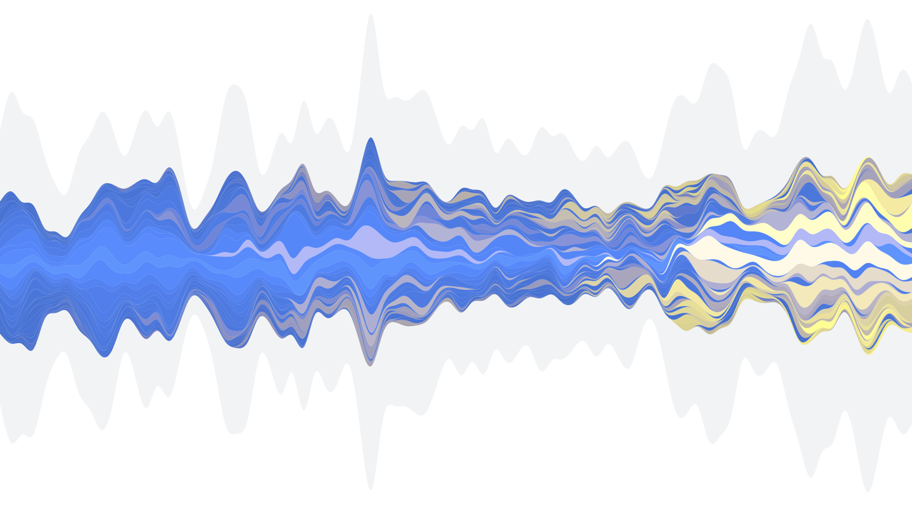

# Music Streamgraph

This is an implementation of [Byron and Wattenberg's Streamgraph](http://leebyron.com/streamgraph/) visualization technique over my personal music history from Jan 2011 to Oct 2017.

The top 20 artists of each month are plotted as foreground layers, with all other logged tracks placed in the light grey background layer. Artists with an earlier discovery date (based on date of first listen) are a blue hue and more recently discovered artists gradually tend towards yellow. Popular artists are plotted with increased brightness, with popularity defined as average number of weekly plays since first discovery. However, this is only approximate as the 2D color palette was selected subjectively, to visual taste.

Rather than placing static inline labels, layers are selectable via mouseover/tap to reveal additional information.



## Building

Install dependencies:
```sh
npm install
```

Build with Webpack:
```sh
npm run compile
```

The output in the `dist` directory is ready to deploy to any static web server.